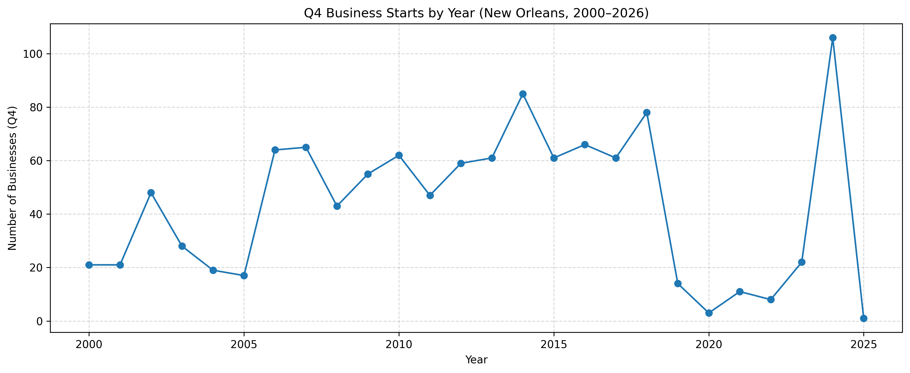
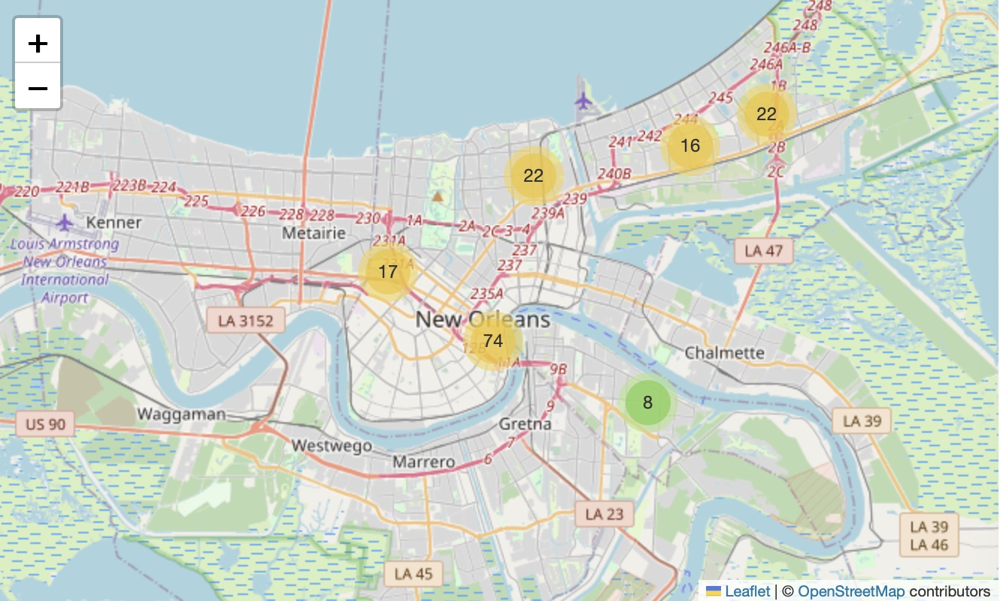

# New Orleans Business License Analysis

## Project Overview

This project analyzes active business license data for the City of New Orleans to understand **business growth trends, seasonality, and geographic concentration**. The goal is to turn raw public records into clear, decision‑ready insights using Python, pandas, and data visuals.

The analysis focuses on:

* How business openings change over time.
* Seasonal patterns (especially Q4 activity).
* The most common types of businesses.
* Where businesses are concentrated across the city.

## Live Interactive Site

Explore the interactive maps and visual dashboards here:  
**[https://HCBrooks-lab.github.io/nola_occ_licenses25/](https://hcbrooks-lab.github.io/nola_occ_lic26/)**

---

## Dataset

* **Source:** City of New Orleans – Active Occupational Licenses
* **Records:** ~10,900 businesses
* **Time Range:** 2000–2026
* **Granularity:** Individual business license records

Basic cleaning was performed before analysis (column normalization, date parsing, ZIP cleanup, and removal of records missing required identifiers).

---

## Key Analysis & Visuals

### 1. Business Starts Over Time - Yearly (2000–2026)

This chart shows how many new businesses started each year. It highlights long‑term growth patterns and year‑to‑year fluctuations rather than focusing on individual business details.

---

### 2. Q4 Business Starts by Year - Q4 of Each Year

This chart focuses only on **Q4 (October–December)** business starts. Looking at Q4 separately helps reveal seasonal behavior tied to tourism, holidays, and year‑end planning.

---

### 3. Top 10 Business Types in Q4 (2000–2026)

This bar chart shows the **most common business types that start during Q4** across all years. It highlights which industries are most active at year‑end.

---

### 4. Geographic Business Density Map

This map shows where new businesses tend to cluster across New Orleans. Areas with larger or brighter circles indicate higher concentrations of business activity.

---

## Tools & Skills Used

* **Python** (pandas, matplotlib, seaborn)
* **Data Cleaning & Validation**
* **Time‑Series Analysis**
* **Geospatial Visualization (Folium heatmaps)**
* **Data Storytelling & Documentation**

---

## Key Takeaways

* Business activity shows clear **seasonal patterns**, with Q4 playing a significant role.
* A small number of business types account for a large share of licenses.
* Business density is **highly concentrated in specific ZIP codes**, reflecting commercial
  hubs.
* Long‑term trends provide more insight than single‑year changes.

---

## Notes

This project emphasizes **clarity over complexity**. Each chart answers a specific question, and overlapping visuals were intentionally avoided to keep the analysis focused and readable.
