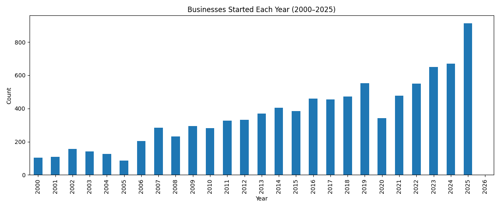
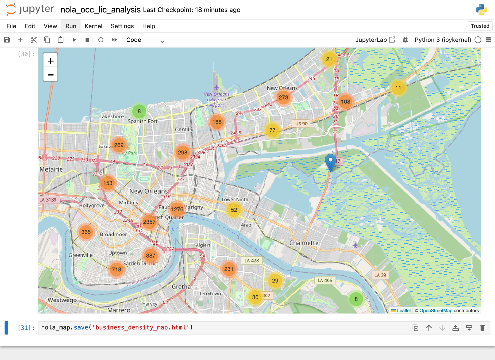

## NOLA Occupational License Analysis
This project analyzes New Orleans occupational license data to show trends in business activity across the city from 2015 to 2025. Using Python and pandas, the analysis identifies seasonal patterns in business openings, highlights ZIP codes with the highest concentration of businesses, and explores how business types are distributed across the area. 

---

## Key Findings
- Certain occupational license types dominate overall business activity in
  New Orleans.
- Business density shows clear geographic clustering rather than uniform
  distribution.
- Exploratory analysis highlights patterns useful for city planning,
  economic development, and market research.

---

## Key Features
  # Data Cleaning & Preparation
  - Removed `business_name` entries to maintain data integrity.
  - Converted `business_start_date` to datetime format for time-based
    review.
  - Extracted `business_start_year` and `year_month` for temporal insights.

  # Trend Analysis
  - Visualized business openings from 2015-2025, showing seasonal surges.
  - Highlighted 6-month intervals for readability while keeping underlying
    trends.

  # ZIP Code Analysis
  - Identified the top 10 ZIP codes with the highest number of licensed
    businesses.
  - Visualized results using a horizontal bar chart to business clustering
    in zones with higher activity such as 70016, 70130, and 70119.

  # Notebook Organization
  - Markdown sections show/describe each step: data cleaning, feature
    extraction,visualization, and interpretation.
  - Sequential logic for easy reproducibility.

## Tools Used
  - Python (pandas, matplotlib)
  - Jupyter Notebook/VS Code
  - CSV Data Source: `active_occ_licenses_2025.csv`

---

## Visuals
# 1. Business Start Trends (2015-2025)
  This line chart visualizes how new business openings in the city have      fluctuated over the last decade. It shows possible seasonal surges tied    to city events, tourism patterns, or administrative cycles. 

  

# 2. Business Density Map (Interactive View)
  To show geographic context, an interactive density map was created using   `folium`, which shows spatial distribution of licensed businesses around   New Orleans. Each point represents a business, with clusters showing     
  areas of high concentration, often near commercial or tourist areas. 
  
  

---

## Potential Extensions
- Business type distribution by ZIP code (heatmap)
- Expanded interactive mapping using Folium
- Year-over-year business growth analysis
- Optional dashboard for summary insights

### Purpose of Roadmap
These milestones outline a clear path for continuing project development while showing examples of:
- Consistent use of data visualization and storytelling.
- Growth into geospatial and dashboarding tools for analytics
  communication.
- Realistic time management and project planning. 

